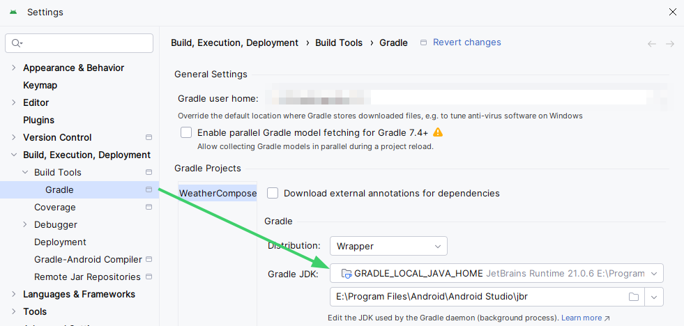

# WeatherCompose

Прогноз погоды — Android-приложение, которое позволяет просматривать погоду в сохранённых городах.

> Для тестирования использовалась Android Studio Narwhal Feature Drop | 2025.1.2 Patch 2

## Как запустить

1. Склонировать проект:

```bash
   git clone https://github.com/l-d-off/WeatherCompose.git
```

2. Импортировать проект в Android Studio.


3. В Android Studio открыть Settings → Build, Execution, Deployment → Build Tools → Gradle и
   установить Gradle JDK не ниже 17.



## Используемые технологии

- Kotlin, Jetpack Compose
- Room и DataStore для локального хранения данных
- Retrofit для работы с API [Open-Meteo](https://open-meteo.com/)
- Material3 / Material Kit для дизайна
- Hilt для внедрения зависимостей
- AES + PBKDF2 для шифрования логина и пароля

## Функционал

### Экран авторизации

- Ввод логина и пароля.
- Сохранение данных локально с шифрованием.
- При повторном входе, если данные сохранены, переход на главный экран.

### Главный экран

- Отображение прогноза погоды для добавленных городов (по умолчанию 4 города).
- Автоматическое обновление прогноза раз в 10 секунд.
- Возможность ручного обновления свайпом сверху.
- Иконки погодных условий (используются из Material Kit).
- Кнопка перехода на экран "Города".
- Кнопка выхода из аккаунта для возврата на экран авторизации.

### Экран "Города"

- Отображение всех ранее добавленных городов.
- Кнопка "добавить" для открытия окна поиска городов.
- Возможность поиска городов для добавления.
- Возможность удаления города через свайп справа налево.
- Хранения городов в локальной БД.
